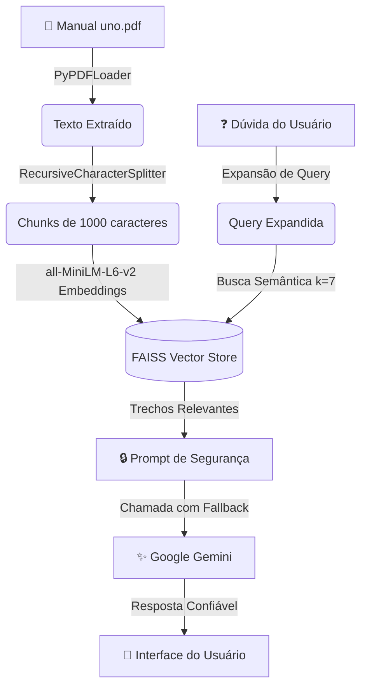

<div align="center">

# 🃏 Fiscal do UNO
### RAG Assistant

<p>
  
  
  
  
  
</p>

</div>

---

## 💡 Visão Geral

O **Fiscal do UNO** é um assistente inteligente baseado em **RAG** (*Retrieval-Augmented Generation*) desenvolvido para responder dúvidas e resolver debates acalorados sobre as regras oficiais do jogo de cartas **UNO**.

Para garantir que o assistente seja justo e preciso, ele utiliza o **PDF de regras oficiais do UNO** como sua **única fonte da verdade**. Caso uma regra polêmica (ou inventada pelos jogadores) não esteja no manual, o assistente recusará a responder ou afirmará que a regra não foi localizada — evitando alucinações e garantindo harmonia na partida. ✌️

---

## 🛠️ Tecnologias Utilizadas

| Tecnologia | Função |
|---|---|
| [Streamlit](https://streamlit.io/) | Interface web com tema escuro nas cores do UNO |
| [LangChain](https://www.langchain.com/) | Orquestração do pipeline RAG (carregamento, chunking, recuperação) |
| [FAISS](https://github.com/facebookresearch/faiss) | Banco vetorial local para busca semântica ultrarrápida |
| [Google Gemini API](https://ai.google.dev/) | Geração de respostas com fallback automático de modelos |
| `all-MiniLM-L6-v2` | Embeddings locais em CPU via `sentence-transformers` |

---

## 📂 Estrutura do Projeto

```text
chatBotUno/
├── pdf/
│   └── uno.pdf                  # Manual oficial de regras do UNO
├── data/
│   └── faiss_index_uno/         # Índice vetorial gerado pelo FAISS
│       ├── index.faiss          # Dados vetoriais do manual indexado
│       └── index.pkl            # Metadados e mapeamento dos chunks
├── app.py                       # Interface Streamlit + chat interativo
├── rag.py                       # Pipeline RAG (indexação, busca, LLM)
├── config.py                    # Configurações globais e variáveis de ambiente
├── .env                         # Chave de API (não versionado no Git)
└── README.md                    # Documentação do projeto
```

---

## ⚙️ Como Executar

### 1. Pré-requisitos

- Python **3.9+** instalado

### 2. Instalar as dependências

```bash
pip install streamlit langchain langchain-community langchain-huggingface langchain-google-genai faiss-cpu sentence-transformers pypdf python-dotenv
```

### 3. Configurar a chave de API

Crie um arquivo `.env` na raiz do projeto com o seguinte conteúdo:

```env
GOOGLE_API_KEY=sua_chave_de_api_aqui
```

> 💡 Você pode obter sua chave gratuitamente em [ai.google.dev](https://ai.google.dev).

### 4. Iniciar a aplicação

```bash
streamlit run app.py
```

O Streamlit abrirá a interface automaticamente no seu navegador. Na primeira execução, o índice FAISS será gerado automaticamente a partir do `pdf/uno.pdf`.

---

## 🧠 Como Funciona (Fluxo RAG)



### Detalhamento do fluxo

1. **Indexação Dinâmica** — Na primeira execução, o sistema lê `pdf/uno.pdf`, divide o conteúdo em blocos de `1000` caracteres (com overlap de `200`) e gera a base vetorial com FAISS.

2. **Expansão de Query** — Expressões comuns da pergunta (ex: `+4`, `UNO`, `pular`) são detectadas e palavras-chave oficiais do manual são adicionadas à consulta para melhorar a busca semântica.

3. **Filtro de Segurança** — O prompt instrui o modelo a ignorar qualquer conhecimento externo ao PDF. Se a regra não estiver no manual, o assistente responde:
   > *"Desculpe, não encontrei essa regra no manual oficial."*

4. **Fallback Automático** — Se um modelo falhar por limite de cota, o sistema tenta automaticamente os próximos modelos disponíveis (`gemini-2.5-flash` → `gemini-2.0-flash` → ...) para garantir que a partida não trave. 🔄

---

## 📄 Licença

Este projeto está sob a licença MIT. Consulte o arquivo `LICENSE` para mais detalhes.
